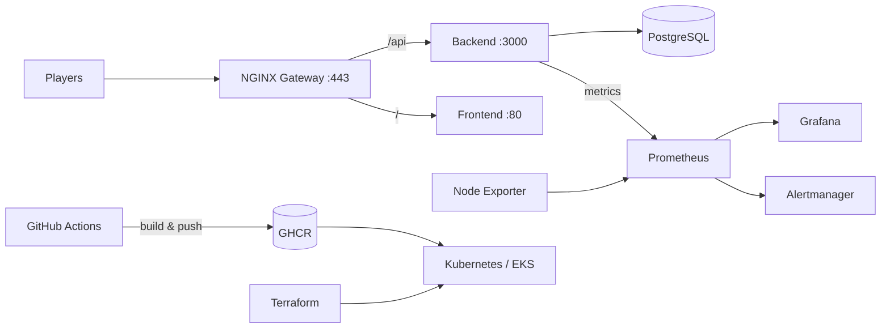

# ArenaX DevOps

Infrastructure-as-code and deployment tooling for the ArenaX platform. Owns the full delivery pipeline: container images, CI/CD, cloud infrastructure, orchestration, monitoring, and the public gateway.

## Architecture



## Stack

| Layer | Technology |
|-------|------------|
| Containers | Docker, multi-stage builds |
| Orchestration | Docker Compose (local), Kubernetes / EKS |
| Infrastructure | Terraform (VPC, EKS) |
| CI/CD | GitHub Actions (build, test, deploy) |
| Gateway | NGINX reverse proxy + TLS |
| Monitoring | Prometheus, Grafana, Node Exporter |
| Storage | PostgreSQL (StatefulSet / Docker volume) |

## Pipelines

- **build.yml** — Docker builds for backend/frontend, published to GHCR on `main` and version tags
- **test.yml** — lint, unit tests, and builds via a shared composite action; runs on PRs
- **deploy.yml** — `kubectl apply` for staging/production with rollout verification

## Environments

- **staging** — every push to `main`
- **production** — version tags and manual dispatch

## Repository Structure

```
.github/
  actions/setup-env/        # Shared Node.js setup
  workflows/                # build, test, deploy pipelines
terraform/                  # AWS provider, VPC + EKS modules
kubernetes/
  namespace.yaml            # Namespace, quota, limits
  secrets.yaml              # Secrets (values injected at deploy time)
  configmap.yaml            # App configuration
  backend-deployment.yaml   # API workload + probes
  frontend-deployment.yaml  # Web workload
  postgres-statefulset.yaml # Database with PVC
  ingress.yaml              # NGINX ingress with TLS
  production/               # Production overrides
monitoring/
  prometheus/               # Scrape configs + alert rules
  grafana/                  # Provisioned dashboards
  node-exporter.yaml        # Host metrics DaemonSet
nginx/                      # Gateway, TLS, reverse proxy
docker-compose.yml          # Local development stack
docker-compose.prod.yml     # Production stack
docs/deployment.md          # Deployment guide
```

## Local Development

```bash
cp .env.example .env
docker compose up -d --build
```

## Documentation

See [docs/deployment.md](docs/deployment.md) for the full deployment guide.
